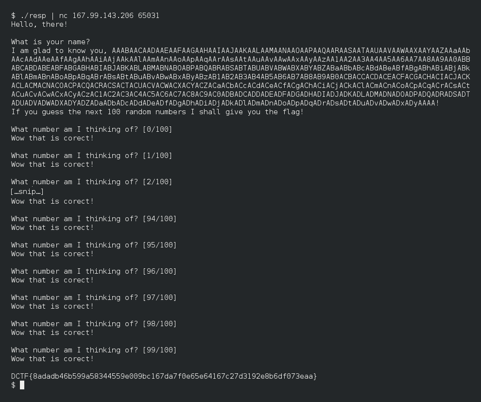

Lucky?
======

Points: 50
Solves: 139


Description
-----------

```
How lucky are you?
Target: 167.99.143.206 65031
Bin: https://dctf.def.camp/dctf-18-quals-81249812/lucky
Author: Lucian Nitescu
```


Files
-----

* [lucky](lucky), the binary given by organizers
* [lucky.i64](lucky.i64), my IDA database, after reversing it
* [resp.c](resp.c), my solution
* [poc.png](poc.png), screenshot of my solution


Solution
--------

The binary is a little game which, when the user win, will print the flag. The
game aims to guess a random number.

After observation, the binary will:

1. Choose a random seed from `/dev/urandom` and initialize the PRNG with it.
2. Take a pseudo-random seed, from `rand()`.
3. Copy the username from a C++ string to a `char[]`.
4. Initialize the PRNG with the pseudo-random seed, taken at step 2.
5. Play the game.

Of course, the copy is very suspicious. Of course, the creator of this challenge
put a buffer overflow at theses steps. And this buffer overflow allow to rewrite
the pseudo-random seed after 700 chars.

So, we can choose our own seed.

Lets start attacking it.


First, we choose a username, with 700 random chars followed by `AAAA`. As it,
the chosen seed will be `0x41414141`. For [resp.c](resp.c), I choose a De Bruijn
sequence.

```c
puts(…"AAAA");
```


Then, we must initialize our seed with the same seed of the server.

```c
srand(0x41414141);
```


And we just have to send the 100 pseudo-random number get with `rand()`.

```c
for (i = 0 ; i < NB_CHALLS ; ++i) {
	printf("%d\n", rand());
}
```


Result:


