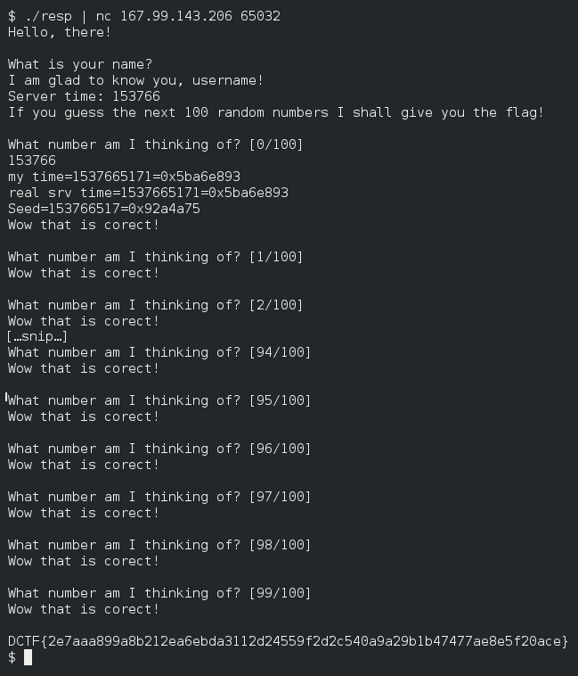

Even more lucky?
================

Points: 50  
Solves: 119

Description
-----------

```
We have updated the lucky game just for you! Now the executable is lighter and more efficient.
Target: 167.99.143.206 65032
Bin: https://dctf.def.camp/dctf-18-quals-81249812/lucky2
Author: Lucian Nitescu 
```


Files
-----

* [lucky2](lucky2), the binary given by organizers
* [lucky2.i64](lucky2.i64), my IDA database, after reversing it
* [resp.c](resp.c), my solution
* [poc.png](poc.png), screenshot of my solution


Solution
--------

The binary is a little game which, when the user win, will print the flag. The
game aims to guess a random number.

After observation, the binary will:

1. Get the timestamp.
2. Initialize the seed with `timestamp / 10`.
3. Print the `timestamp / 10000`, which is the time modulo 2 hours 46 minutes
   and 40 seconds.
4. Play the game.

Contrary to the challenge "Lucky?", no buffer overflow can be done. But, the
seed is predictable.

Lets attack it.


First, we need to print a username.

```c
puts("username");
```


Next, we need to get the server timestamp to regulate our hour to its timezone.
Because I was too lazy to parse the server output, and a *copy-pasta* is not
complex (^^), I has just get the server time with a simple `scanf()`.

```c
#define DIFF_TIME 0 /* sometimes, we can have some second of difference. */
time_t mytime = time(0);  /* Get my time */
time_t srvtime = 0;
int seed = 0;

scanf("%d", &srvtime);  /* Get the server time (w/ User interaction */
/* guess the server time */
srvtime = (srvtime * 10000) + (mytime % 10000);
srvtime -= DIFF_TIME
/* get the seed */
seed = srvtime / 10;
```


Then, we must initialize our seed with the same seed of the server.

```c
srand(srvtime/10);
```


And we just have to send the 100 pseudo-random number get with `rand()`.

```c
for (i = 0 ; i < NB_CHALLS ; ++i) {
	printf("%d\n", rand());
}
```

Result:


