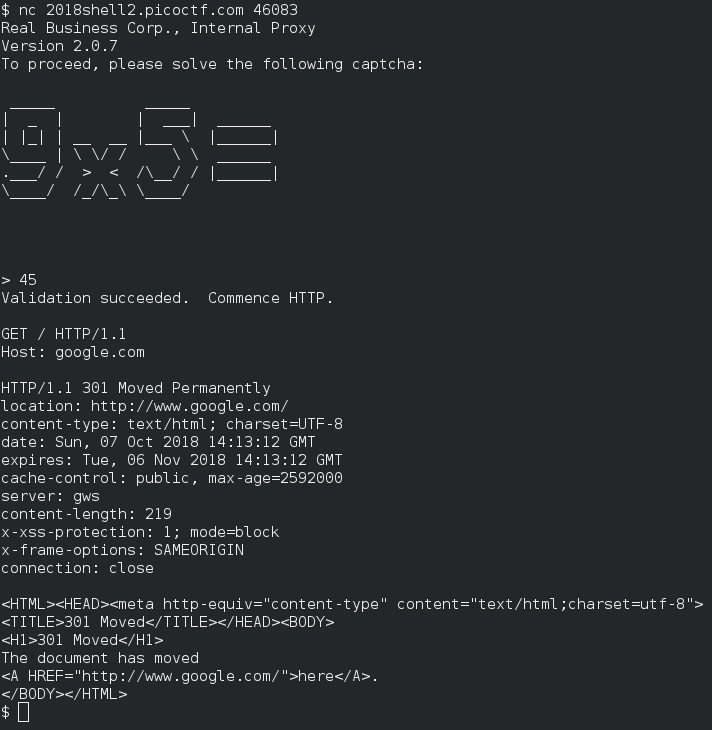
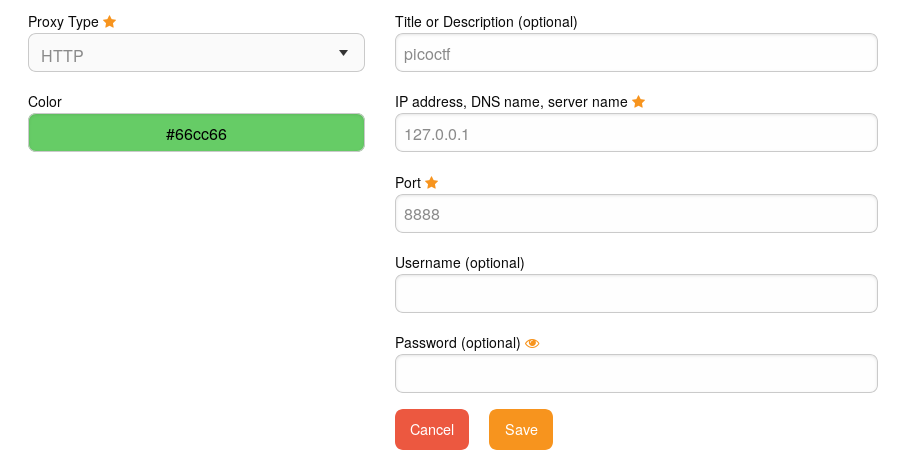

Artisinal Handcrafted HTTP 3
============================

Points: 300  
Solves: 642

Flag: `picoCTF{0nLY_Us3_n0N_GmO_xF3r_pR0tOcol5_72f2}.`


Description
-----------

We found a hidden flag server hiding behind a proxy, but the proxy has some...
_interesting_ ideas of what qualifies someone to make HTTP requests. Looks like
you'll have to do this one by hand. Try connecting via `nc
2018shell2.picoctf.com 46083`, and use the proxy to send HTTP requests to
`flag.local`. We've also recovered a username and a password for you to use on
the login page: `realbusinessuser`/`potoooooooo`. 


Solution
--------

When we are trying a TCP connection, with netcat, on the server, we have a
textual captcha. After fill this captcha, we have a TCP connection to an HTTP
reverse proxy. 

The description gives us a host and credentials. We just have to connect to this
host and fill, with hands, the login form and win the flag… oooor so, we may
have to waste time and automate the process to use a browser, a stupid choice I
made.

So, to have always a good answer to the captcha, I've based my script on the
first column of the char to decrypt it. I mean, to recognize the `2`, write with
as following:

```
 _____
/ __  \
`' / /'
  / /
./ /___
\_____/
```

my script parse only :

```
 
/
`
 
.
\
```

and apply a shifting for the next char. When the first line is the same for some
char, as the `+` and the `-`, my script will only read the second or the third
column:

```
 ______             _
|______|            _
   _       becomes 
 _| |               |
|_   _|
  |_|               |
```

Then, it listen a TCP port, the `8888`. To be able to browse to the target host,
we need to parametrize our browser to use the HTTP proxy `127.0.0.1:8888`.


Then, after filling the login form, we have the flag ! 
