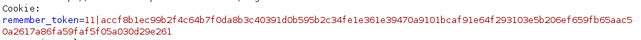
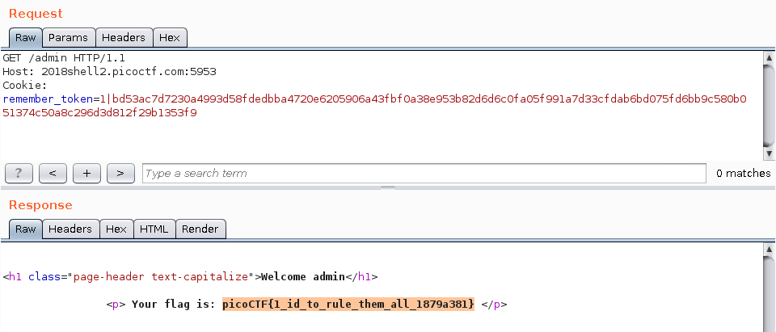

Flaskcards Skeleton Key
=======================

Points: 600  
Solves: 353

Flag: `picoCTF{1_id_to_rule_them_all_1879a381}`

Description
-----------

Nice! You found out they were sending the Secret_key:
06f4eefabf03b8f4e521fbdada13f65c. Now, can you find a way to log in as admin?
http://2018shell2.picoctf.com:5953. 

Solution
--------

This website look like the challenge "Flaskcards", but without the template
injection, and with a new feature: the "Remember Me" checkbox. When we check
this box, the session cookie has always the same behaviour, but another cookie,
named "remember_token", is set. The content of this cookie is a sequential user
ID and a SHA512 hash separated by a `|` char. 

After researches in the [Flask's
documentation](http://flask.pocoo.org/docs/1.0/api/#flask.sessions.SecureCookieSessionInterface.key_derivation),
we found that Flask is creating session cookies using hmac. So, after creating
the HMAC of the user ID `1` (probably the admin user ID), I found the flag on
the admin page. 
