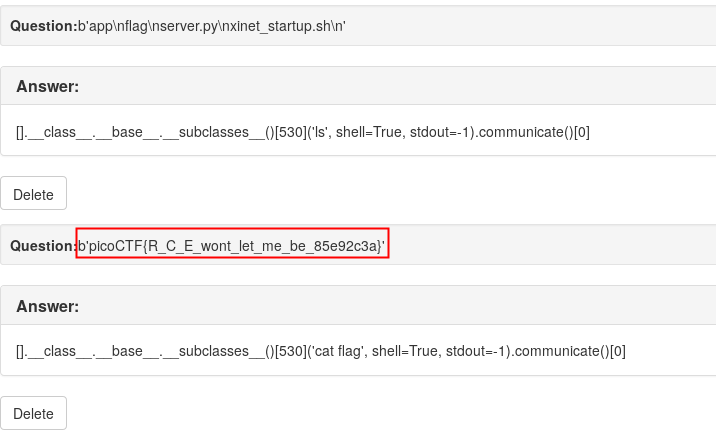

Flaskcards and Freedom
======================

Points: 900  
Solves: 246

Flag: `picoCTF{R_C_E_wont_let_me_be_85e92c3a}`

Description
-----------

There seem to be a few more files stored on the flash card server but we can't
login. Can you? http://2018shell2.picoctf.com:56944

Solution
--------

When we create a card with the question `{{2**2}}`, the question, in the list,
is printed as `4`. So we have a server-side template injection.

Following the identification from the first ressource (PortSwigger's blog post),
and of the second ressource (swisskyrepo's cheatsheet), we determine that the
template engine is Jinja2.

So it's time to begin to dump main values and start recon. After dumping classes
loaded (with command `{{[].__class__.__base__.__subclasses__()}}`), we notice
the presence of the class `subprocess.Popen` at index `530`. Great ! We can use
it to execute commands ! After a little POC on a python shell and after reading
docs of `subprocess` module, we can see that the option `shell` allow us to
execute a shell command and the option `stdout` allow us to get the output of
the command by calling the method `communicate` of the `Popen` instance.

So we are listing file in the current diretory with the command
`{{[].__class__.__base__.__subclasses__()[530]('ls', shell=True,
stdout=-1).communicate()[0]}}`. We notice a file nammed `flag`, then just
dumpping it with a `cat` command
(`{{[].__class__.__base__.__subclasses__()[530]('cat flag', shell=True,
stdout=-1).communicate()[0]}}`).

Ressources
----------

1. "Server-Side Template Injection" from the PortSwigger Web Security Blog  
	https://portswigger.net/blog/server-side-template-injection
2. "Templates Injections" from swisskyrepo's PayloadsAllTheThings github repo  
	https://github.com/swisskyrepo/PayloadsAllTheThings/tree/master/Server%20Side%20Template%20injections
