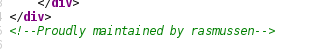

Help Me Reset 2
===============

Points: 600  
Solves: 466

Flag: `picoCTF{i_thought_i_could_remember_those_a131a54c}`

Description
-----------

There is a website running at http://2018shell2.picoctf.com:38834. We need to
get into any user for a flag! 

Solution
--------

The website is a private website (which give the flag, when the user is logged
in). The only section this website have are a login page ang a process to reset
the password.

When we try to reset the password, first of all, we need an existing username.
In a comment in the home page, we have a username. Here we will reset the
password of *rasmussen*. 

Then the system ask a random security question. We have three chance for every
reply, then account is blocked (which is a vulnerability, think about this big
issue when you are creating a system)… except if we re-use the same cookie.

So, for every question, we are able to find, on Wikipedia, a list. We just have
to execute an exhaustive search to have correct reply to the different security
questions. Here, *rasmussen* loves *Honda*'s car (!()[Honda.png]), the *white*
color (!()[White.png]) and *superman* (!()[Superman.png]).

With these information, we are able to reply to the three security questions
required to reset the password. After these security questions, the system ask a
new password. After set it and logging in, we have the flag. !()[flag.png]
